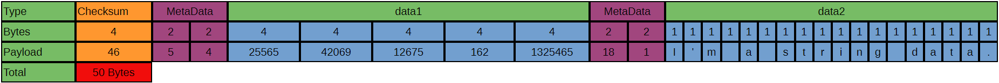

# Byte Array Serialization for C++

## Description

Multi-purpose byte array serialization lib for C++ classes or any type of data.\
This lib provide a way to easily serialize classes for networking purpose or to save them into binary file (even though you're probably better using json or xml in this case)

--------
## Usage Example

Here is a quick example of how the serialization process works

```c++
#include "bas.hpp"
#include <string>

class SerializablePerson : public bas::Serializable {        // inherit from the Serializable class
public:
    SerializablePerson(const std::string& name, int age)
        : name(name)
        , age(age)
    {
    }

    ~SerializablePerson() = default;

    // this function contains the serialization process of your class
    void makeSerialization(bas::SerializedObject& obj) override
    {
        obj.pushData(name);                     
        obj.pushData(age);
    }

    // this function contains the unserialization process of your class
    void makeUnserialization(bas::SerializedObject& obj) override
    {
        name = obj.popData<std::string>();
        age = obj.popData<int>();
    }

    std::string name;
    int age;
};

int main(void)
{
    SerializablePerson person1("David", 32);
    SerializablePerson person2("Robert", 45);

    bas::SerializedObject obj;

    obj = person1.serialize();                              // Use serialize() and not makeSerialization()

    person2.unserialize(obj);                               // Use unserialize() and not makeUnserialization()
    // person2 is now a copy of person1
    return 0;
}
```
--------
## Pros & Cons

## Pros

### 1. Size

let's consider this simple json payload:

```
{"data1":[25565,42069,12675,162,1325465],"data2":"I'm a string data."}
```

This json payload is 63 Bytes long.
Now let's look at the payload of a serialized object equivalent to this json snippet:



The serialized object payload is much smaller in most cases.

### 2. Speed

/!\ the following assumptions haven't been tested yet, they're assumptions /!\

Since the ByteArraySerialization lib does not parse, expect the process of serialization/unserialization to be much faster than json/xml.

## Cons

### 1. Flexibility & Readability

The payload of the serialized object isn't nearly as flexible as it's usual json alternatives.

### 2. Availability

For now the ByteArraySerialization lib is only available for c++.

--------
## Installation

```
git clone https://github.com/Nellousan/ByteArraySerialization.git
cd ByteArraySerialisation
cp include/bas.hpp the/path/to/your/poject's/include/folder
```

Since this lib is header only and fits into one file, using it is a simple as grabbing the bas.hpp file and add it into your include path of your project and it's ready to go.

--------
## Documentation
\
Here is a [link](https://nellousan.github.io/ByteArraySerialization/) to the documentation of the project.

--------
## TO-DO

- Unit Tests
- Make a release and versionning stuff
- Test speed against xml/json
